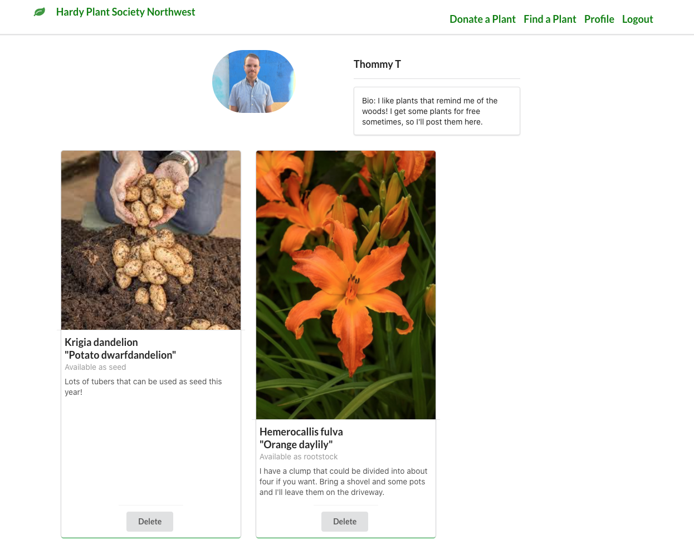

## Intro
---
The <strong> Hardy Plant Society </strong> is a gardening club where plant enthusiasts can share plants and find plants that are on offer- either for sale by the club, or donated by community members for the public. Club administrators can post plants and seeds that are for sale and they can update news and events on the home page. This site leverates data from the [Trefle API][1] so that users can find the exact plant they are trying to share and get more photos and information about posts. 

## Background
---
I built this project around a [real gardening club][2] that I have been involved with for years. There are a number of clubs of dedicated horticulturalists throughout the world who would benefit from an easy way to share plants and find seeds for plants they cannot find.  

 The <strong>Hardy Plant Society</strong> web application lets gardeners share and find plants quickly with more information about the plants than you would find at nursery. 

Users currently trade plants through Facebook or Craigslist, but many gardeners still toss plants simply because there isn't an easy way for them to make their unwanted plants known to other gardeners who will appreciate them. Having a gardening club sponsored plant swap helps people who want to know more information about what they are getting rid of or what they want to find.
<strong> The Hardy Plant Society </strong> achieves this with the following features:
  
- Users can contact eachother to arrange pickup, or they can connect the club organizers to purchase plants for sale.
- A quick search through Trefle's database of over a million plants helps people find their exact species by name, common name and photo.
- Photo uploads help describe the specific posts, and more photos of the plants' flowers and habitats are automatically added by Trefle along with a description and a list of countries where the plant is native.
- Club admins can post their catalogue of plants and seeds on offer to raise money for the club. They can also post news and events on the home page.

## Screenshots
---

 <strong> Home Page</strong> (expand for more views)

  
<strong> Log In  </strong>

  
<strong> Plant Swap </strong>

<strong> Search for the plant you are donating </strong> 

 
<strong> Add details for the post </strong>

<strong> Delete posts from your profile page</strong>

<strong> Request a plant by emailing another user </strong>

<strong> Admin Signup</strong>

<strong> Admins can edit posts </strong>

  

## Technologies Used
---
- React
- Javascript
- MongoDB
- Node.js
- Express
- Fetch / AJAX
- HTML
- CSS
- Semantic UI's React Library
- AWS S3 Cloud Storage
- JWT Authentication
- [Trefle API][1]
- EmailJs API

## Getting Started  
---
Check out [The Hardy Plant Society][3]! Create an account to post plants or browse other user's posts. 
  
Project planning elements:  
- My [Trello Planning Board][4] includes workflow details as well as my ERD, Wireframes, and User Stories.

   

## Next Steps  
---
Future enhancements of this project include:  
- adding edit functionality for posts
- adding search functionality within the posts to find specific plants
- a messaging system beyond email could help imporove the experience
- implementing quantities of plants on offer
- displaying more info about donations, such as cultivar and collection date

[1]: https://trefle.io/
[2]: http://www.hardyplantsocietywa.org/
[3]: https://hardy-plant-society.herokuapp.com/
[4]: https://trello.com/b/KXvnP9uP/hardy-plant-society 
